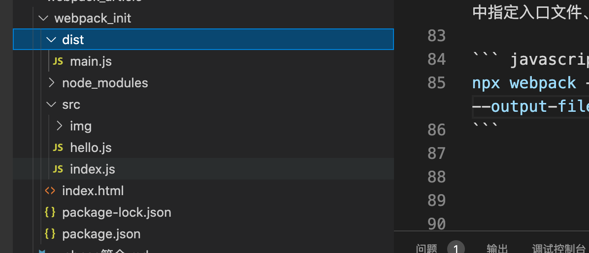
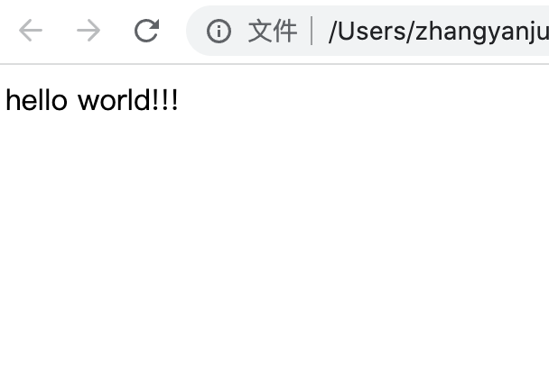
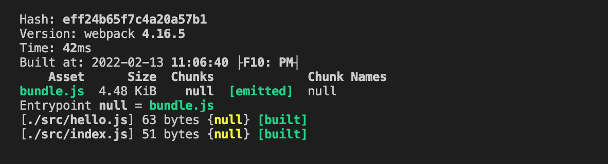
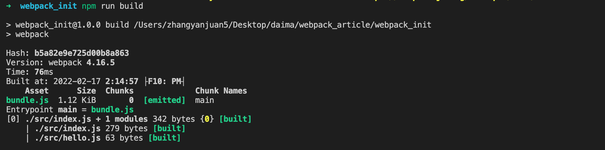
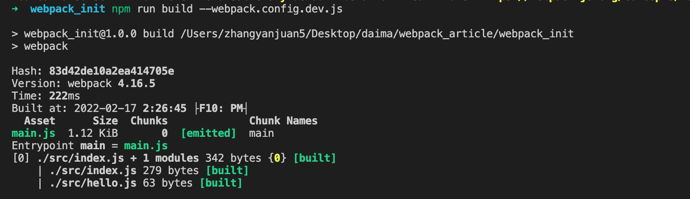

#  webpack简介
## 简介
webpack是一个开源的JavaScript模块打包工具，其最核心的功能是解决模块之间的依赖，根据一个或多个入口文件，将各个模块按照特定的规则生成一个或多个bundle，最终将前端资源打包、压缩、优化。

webpack的核心概念为以下模块，后续会对以下概念针对性输出文章。
- 入口（entry）
- 输出（output）
- loader
- 插件（plugin）
- 模式（mode）
- 浏览器兼容性（browser compatibility）

## 安装
webpack对操作系统没有要求，使用Windows、Mac、Linux操作系统均可，它唯一的依赖是Node.js，所以使用webpack前需要先安装Node.js，安装地址为 [Nodejs]](http://nodejs.cn/download/) 推荐安装TLS（长期维护）版本。node安装完成后，在命令行输入node -v，可显示版本号即安装成功。
接下来，我们需要使用Node.js的包管理器npm来安装webpack，安装模块的方式有两种：一种是全局安装，一种是本地安装，此处我们选择本地安装，主要有以下两点原因：

1. 如果采用全局安装，那在与他人协作时，由于每个人的webpack版本不同，可能导致打包出的内容不一致
2. 通常会通过运行一个或多个 npm scripts 以在本地 node_modules 目录中查找安装的 webpack，来运行 webpack，所以在这种情况下可能导致本地全局都有，容易造成混淆
```
"scripts": {
    "build": "webpack"
}
```
基于以上两点，我们选择在项目内安装，首先新建一个工程目录，并执行npm的初始化命令

``` javascript
 mkdir webpack_init && cd webpack_init
 npm init
```

命令行输入项目的基本信息，如：名称、版本、描述、仓库地址等信息。成功后工程目录中会出现一个package.json文件。
接下来输入安装webpack的命令：
``` javascript
 npm install webpack@4.16.5 webpack-cli@3.3.11 --save-dev
```
由于使用 webpack v4+ 版本，所以还安装了webpack-cli，webpack-cli 提供了许多命令用于在命令行中运行 webpack。具体包含命令可查看文档[webpack-cli]](https://webpack.docschina.org/api/cli/) 检查安装是否成功执行webpack -v，webpack-cli -v，显示对应版本则安装成功

安装过程中踩坑记录
``` javascript
 # 打包过程中执行 npx webpack 报错：[webpack-cli] TypeError: compiler.getInfrastructureLogger is not a function
 # webpack 与webpack-cli版本不兼容
```

## 打包第一个应用
在webpack_init文件夹下添加index.html、src文件夹下添加index.js、hello.js文件

index.html
``` javascript
<!doctype html>
<html>
  <head>
    <title>demo</title>
  </head>
  <body>
    <script src="./dist/main.js"></script>
  </body>
</html>
```

src/index.js
``` javascript
import helloWorld from './hello.js';

function component() {
  var element = document.createElement('div'); 
  element.innerHTML = helloWorld();
  return element;
}

document.body.appendChild(component());
```

src/hello.js
``` javascript
export default function() {
    return 'hello world!!!'
}
```

在控制台输入打包命令 npx webpack，
``` javascript
npx webpack
```
因为npm会从全局模块中找webpack，但是我并非全局安装，而是项目本地安装，所以报错。所以需要npx命令运行命令。npx会先找项目中的node_modules中的包文件，执行命令成功后会在项目中增加一个dist文件，文件中有一个打包后的main.js文件。


此时我们在浏览器中打开index.html 文件，在页面中看到 hello world!!!



在上面的命令中，我们采用了webpack的默认设置，我们也可以在命令行中指定入口文件、输出文件、打包模式等信息

``` javascript
npx webpack --entry=./src/index.js --output-filename=bundle.js --mode=development
```
删除webpack默认配置打包的内容，重新执行带配置的命令，打包后在dist目录下生成了bundle.js文件，将index.html中引入js文件地址main.js改为bundle.js，在浏览器打开index.html发现控制台再一次输出了hello world!!!。

## 使用npm scripts
从上面的命令行配置打包例子来看，每次打包都需要在命令行输入冗长的命令，这样做会很耗时和容易出错，为了使命令更加简洁，可以在package.json文件中的"scripts"对象下添加一个打包命令脚本build。
scripts是npm提供的脚本命令功能，所以在这里我们可以直接使用webpack命令取代之前的npx webpack。

在控制台输入npm命令，打包成功

```
npm run build
```

## 使用配置文件

在webpack4中，可以无需配置采用默认方式打包，直接在控制台输入npx webpack即可打包，然后大多数项目需要很复杂的设置，如项目分包、压缩、懒加载等，所以大多数情况下还是需要一个配置文件，webpack默认加载的配置文件为webpack.config.js，也可以指定webpack配置文件，需要命令行指定。

### webpack.config.js
在项目webpack_init中新建一个webpack.config.js文件

webpack.config.js
```
const path = require('path');

module.exports = {
  entry: './src/index.js',
  output: {
    filename: 'bundle.js',
    path: path.resolve(__dirname, 'dist')
  }
};
```
上面通过module.exports导出了一个对象，将之前命令行中输入的key-value形式的参数放在这个对象中。
这个对象包含连个属性，entry为项目入口文件，output为打包出口文件，其中filename为打包文件名称，path为文件打包路径。通过调用node.js的path模块，将__dirname(node.js内置全局变量，值为当前文件所在的绝对路径)与输出路径连接起来，得到了最终资源输出路径。

现在我们去掉package.json中build后面的参数去掉，只保留"build": "webpack"，然后在控制台输入npm run build，打包成功了


### 使用不同的配置文件

出于某种原因，需要根据特定情况使用不同的配置文件，则可以通过在命令行中使用 --config标志修改
删除项目中的webpack-config.js，新建一个webpack-config-dev.js，内容和webpack-config.js一致。在命令行输入npm run build --config webpack.config.dev.js 或者在package.json的scripts中增加配置
```
  "scripts": {
    "test": "echo \"Error: no test specified\" && exit 1",
    "build": "webpack --config webpack.config.dev.js"
  },
```
执行打包命令后。打包结果如下


总结
在上面我们介绍了
- webpack的作用及包含核心模块
- 如何从零安装一个webpack运行环境
- 打包第一个webpack项目
- 告别命令行，通过配置文件打包webpack
下一节我们将介绍下webpack的配置文件，包含的参数及作用。


